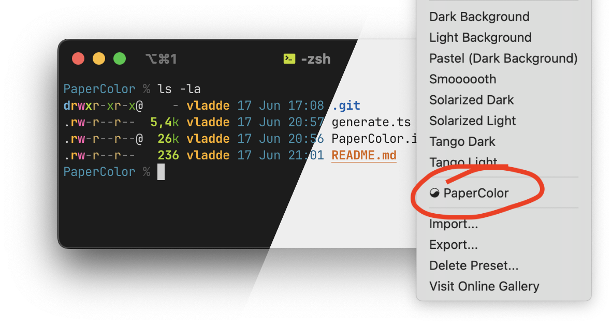

# iterm2 color preset (light/dark)

based entirely on [PaperColor.vim](https://github.com/NLKNguyen/papercolor-theme), using only official colors from palette¹

## build

generate file with `bun generate.ts > PaperColor.itermcolors`

## contribute

update the colors or settings in `generate.ts` and run it (commit separately) and make a pr using conventional commit messages.

¹ okay, dark themed dark blue was hand picked, and dark themed magenta were frankenstein'd from official images. some colors were picked from the other palette because there simple are missing colors
